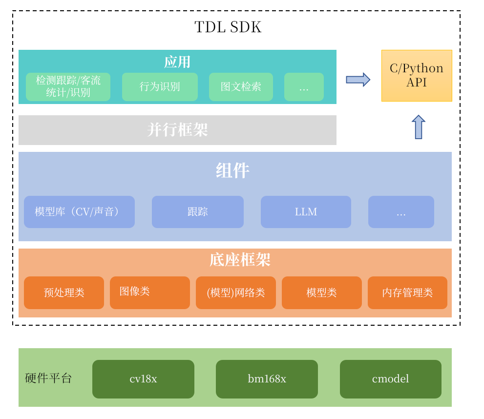

## 介绍

`tdl_sdk(turnkey deep learning sdk)` 是一个基于算能芯片产品的开箱即用深度学习算法SDK，致力于为用户提供跨平台（端、边）、简单易用、资源节约、性能高效的算法库及应用。

当前支持的型号包括：

- CV181X/CV180X
- CV186AH
- BM1688/BM1684X
- CMODEL

## 架构



## 特性

- 实现算法部署的底座框架，适配多种芯片产品，基于该框架可以实现一次部署，多平台运行
- 充分利用自带的硬件加速单元，实现高效推理
- 遵循内存高效原则，避免冗余内存申请及拷贝
- 提供C/C++/Python三种接口，方便快速集成
- 提供众多可直接在端侧场景落地的轻量级模型，涵盖检测、分类、识别、分割、声音指令等，具体见[模型列表](https://github.com/sophgo/tdl_models)
- 支持CMODEL环境（当前仅支持CV181X/CV180X）开发测试

## 快速上手

- 编译，参考[build.md](getting_started/build.md)
- 运行，参考[run.md](getting_started/run.md)，以python为例

  ```python
  from tdl import nn,image
  import sys
  # import cv2 # 如果需要使用cv2读取图片，请取消注释
  if __name__ == "__main__":
      if len(sys.argv) != 3:
          print("Usage: python sample_fd.py <model_path> <image_path>")
          sys.exit(1)
      model_path = sys.argv[1]
      img_path = sys.argv[2]
      face_detector = nn.FaceDetector(nn.ModelType.SCRFD_DET_FACE, model_path)
      img = image.read(img_path)
      # img = cv2.imread(img_path)
      bboxes = face_detector.inference(img)
      print(bboxes)
  ```

- 开发，参考[接口文档](docs/api_reference)、[开发指南](docs/developer_guide)和[sample](sample)

## 参与贡献

- 有任何问题，欢迎提交issue，反馈问题
- 欢迎提交PR，贡献代码

## 版本发布

| 版本号   | 发布时间       | 更新内容                                   |
|----------|----------------|--------------------------------------------|
| v2.0     | 2025-03-31     | 重构框架，支持多芯片及CMODEL|

## 许可证

本项目基于 [BSD 2-Clause License](docs/LICENSE) 许可证开源。
