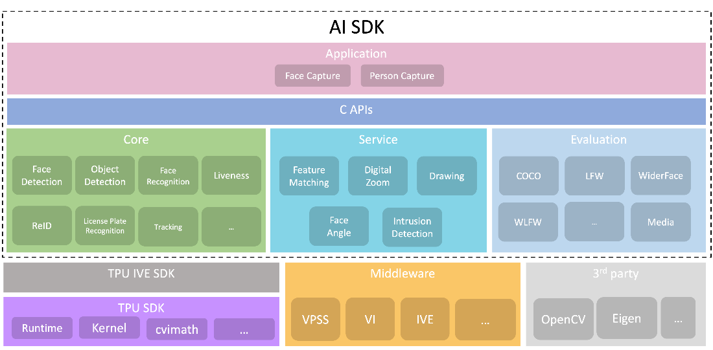

.. vim: syntax=rst

设计概述
=================

系统架构
------------------

下图为AI SDK系统架构图；AI SDK架构在Cvitek的Middleware及TPU SDK上。

主要分为三大模块：Core，Service，Application。

Core主要提供算法相关接口，封装复杂的底层操作及算法细节。令使用者可以直接使用VI或VPSS取得的Video Frame Buffer进行模型推理。

AI SDK内部会对模型进行相应的前后处理，并完成推理。

Service提供算法相关辅助API，例如：绘图, 特征比对, 区域入侵判定等功能。

Application封装应用逻辑，目前包含人脸抓拍的应用逻辑。

   
   Figure 1.

这三个模块分别放在三个Library中:

.. list-table::
   :widths: 1 1 1
   :header-rows: 1

   * - 模块
     - 静态库
     - 动态库

   * - Core
     - libcvai_core.so
     - libcvai_core-static.a

   * - Service
     - libcvai_service.so
     - lib cvai_service-static.a

   * - Application
     - libcvai_app.so
     - libcvai_app-static.a

档案结构
---------------

AI SDK档案结构如下：

.. list-table::
   :widths: 1 1
   :header-rows: 1

   * - 目录名称
     - 说明

   * - include
     - AI SDK 头文件

   * - sample
     - 范例源代码         

   * - doc
     - Markdown格式文檔 

   * - lib
     - AI SDK静态和动态库

   * - bin
     - AI SDK 二进制文件

