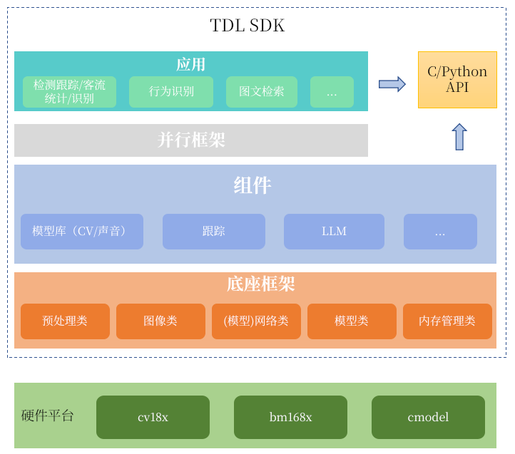

# 框架设计

## 设计原则

* 模块化设计
  * 同类型功能模块抽象出基类，遵循高内聚低耦合
  * 仅对外暴露基类，不暴露具体实现
* 可扩展性
  * 通过继承基类，实现新的功能

* 可维护性
  * 遵循简单易用原则，尽量不引入复杂的设计

## 推理流程


一个模型的推理流程基本如上图所示，对于跨平台推理，需要针对上述的几个环节进行适配，各环节有如下特点：

* 图像表示
  * 不同的平台使用不同的图像结构体
  * 支持不同的格式、stride等
* 预处理
  * 不同平台有不同的预处理硬件单元及配套SDK
  * 预处理的计算逻辑是一致的
* 推理
  * 不同的推理SDK
  * 不同的芯片模式，如单芯、多芯，PCIE、SOC
  * 模型后处理逻辑是一致的

## 框架



说明：

* 底座框架是tdl_sdk的核心层，它实现了对端侧和边侧tpu sdk、多媒体sdk的统一封装，为上层提供统一调用接口
* 使用tdl_sdk进行模块部署的最小依赖是底座框架

## 底座框架


### image

该模块定义在[base_image.hpp](../../include/framework/image/base_image.hpp)，包括BaseImage类和ImageFactory类。

BaseImage类进行统一封装，主要支持如下特性：

* 设计统一的图像类型和数据格式
  * 图像类型

    ```cpp

    enum class ImageFormat {
      GRAY = 0,
      RGB_PLANAR,
      RGB_PACKED,
      BGR_PLANAR,
      BGR_PACKED,
      YUV420SP_UV,  // NV12,semi-planar,one Y plane,one interleaved UV plane,size =
                    // width *height* 1.5
      YUV420SP_VU,  // NV21,semi-planar,one Y plane,one interleaved VU plane,size =
                    // width *height* 1.5
      YUV420P_UV,   // I420,planar,one Y plane(w*h),one U plane(w/2*h/2),one V
                    // plane(w/2*h/2),size = width* height *1.5
      YUV420P_VU,   // YV12,size = width* height *1.5
      YUV422P_UV,   // I422_16,size = width* height *2
      YUV422P_VU,   // YV12_16,size = width* height *2
      YUV422SP_UV,  // NV16,size = width* height *2
      YUV422SP_VU,  // NV61,size = width* height * 2

      UNKOWN
    };
    ```

* 图像数据格式

    ```cpp
    enum class TDLDataType {
      INT8 = 0,
      UINT8 = 1,
      INT16 = 2,
      UINT16 = 3,
      INT32 = 4,
      UINT32 = 5,
      BF16 = 6,
      FP16 = 7,
      FP32 = 8,
      UNKOWN
    };
    ```

* 抽象出统一的常用操作接口
  * 内存相关
    * allocateMemory
    * freeMemory
    * copyFromBuffer
    * setupMemory
    * setupMemoryBlock
    * invalidateCache
    * flushCache
    * randomFill
  * 信息获取相关
    * getWidth
    * getHeight
    * getStrides
    * getPhysicalAddress
    * getVirtualAddress
    * getPlaneNum
    * getImageByteSize
    * getImageFormat
  * 构造相关
    * prepareImageInfo
* 支持不同平台扩展
  * 不同平台图像类型

    ```cpp
    enum class ImageType {
      VPSS_FRAME = 0,
      OPENCV_FRAME,
      FFMPEG_FRAME,
      BMCV_FRAME,
      TENSOR_FRAME,  // input tensor frame
      RAW_FRAME,     // raw frame,just a block of continuous memory
      UNKOWN
    };
    ```

  * 不同平台图像类型派生自BaseImage，内部存放具体的实际图像对象，主要考量
    * 不同平台会有一些特有的硬件特性，比如stride对齐的字节数，直接使用原始对象可以避免此类问题
    * 可以支持配套的图像处理SDK

提供ImageFactory实现一些常用的图像操作，如

* 图像读取
* 图像写入
* 图像转换等

### preprocess

该模块定义在[preprocess.hpp](../../include/framework/preprocess/base_preprocessor.hpp)，

#### 预处理参数

预处理的基本过程，包括如下几个步骤：

* 缩放
  * 可能包含在原图指定区域抠图后缩放
  * 缩放方式
    * 等比例缩放
    * 直接拉伸
  * 插值模式
    * 最近邻插值
    * 双线性插值
    * 双三次插值
* 归一化
  * 包括减均值除以标准差
* 转置
  * 将图像从PACKED模式转换为PLANAR模式，图像格式参

预处理参数定义：

```cpp
struct PreprocessParams {
  ImageFormat dst_image_format;
  TDLDataType dst_pixdata_type;
  int dst_width;
  int dst_height;
  int crop_x;
  int crop_y;
  int crop_width;
  int crop_height;
  float mean[3];
  float scale[3];  // Y=X*scale-mean
  bool keep_aspect_ratio;
};
```

上述参数中：

* dst_image_format、dst_pixdata_type：分别表示输出图像格式和数据类型
* dst_width、dst_height：表示输出图像的宽度和高度
* crop_x、crop_y、crop_width、crop_height：表示裁剪的起始坐标和宽高，假如宽高为0,表示基于原图处理
* mean、scale：表示归一化的参数，计算公式为：Y=X*scale-mean
* keep_aspect_ratio：表示是否保持宽高比

在原始训练代码中，一般使用均值和标准差，预处理的过程如下：

```python
import numpy as np
import cv2

def preprocess(image, dst_width, dst_height, keep_aspect_ratio=True, mean=(0, 0, 0), std=(1, 1, 1)):
    """
    预处理图像，调整大小、归一化、减均值、除标准差。

    Args:
        image (numpy.ndarray): 输入图像 (H, W, C)，BGR顺序。
        dst_width (int): 目标宽度。
        dst_height (int): 目标高度。
        keep_aspect_ratio (bool): 是否保持长宽比。
        mean (tuple): 均值，用于通道均值减法。
        std (tuple): 标准差，用于通道标准化。

    Returns:
        numpy.ndarray: 处理后的图像数组 (C, dst_height, dst_width)，通道顺序为RGB。
    """
    # 调整尺寸
    if keep_aspect_ratio:
        h, w = image.shape[:2]
        scale = min(dst_width / w, dst_height / h)
        new_w, new_h = int(w * scale), int(h * scale)
        resized_image = cv2.resize(image, (new_w, new_h))
        
        # 创建空白图像并居中放置
        processed_image = np.zeros((dst_height, dst_width, 3), dtype=np.uint8)
        pad_top = (dst_height - new_h) // 2
        pad_left = (dst_width - new_w) // 2
        processed_image[pad_top:pad_top+new_h, pad_left:pad_left+new_w, :] = resized_image
    else:
        processed_image = cv2.resize(image, (dst_width, dst_height))

    # BGR 转换为 RGB
    processed_image = cv2.cvtColor(processed_image, cv2.COLOR_BGR2RGB)

    # 转换为浮点类型并归一化到 [0, 1]
    processed_image = processed_image.astype(np.float32) / 255.0

    # 减均值，除标准差
    mean = np.array(mean).reshape(1, 1, 3)
    std = np.array(std).reshape(1, 1, 3)
    processed_image = (processed_image - mean) / std

    # 调整维度顺序为 (C, H, W)
    processed_image = processed_image.transpose(2, 0, 1)

    return processed_image

```

当前预处理参数，与原始训练代码的参数的转换关系如下：

* scale_tdl = 1/std
* mean_tdl = -mean/std

#### 具体实现

当前边侧和端侧使用不同的预处理SDK

* 端侧使用vpss，对应实现为[vpss_preprocessor.hpp](../../include/framework/preprocess/vpss_preprocessor.hpp)
* 边侧使用opencv，对应实现为[opencv_preprocessor.hpp](../../include/framework/preprocess/opencv_preprocessor.hpp)
* 预处理的输入为BaseImage和预处理参数，输出为BaseImage
* 使用PreprocessorFactory创建具体的预处理对象

### memory

该模块定义在[memory.hpp](../../include/framework/memory/base_memory_pool.hpp)，包含BaseMemoryPool类和MemoryPoolFactory两个类。

内存对象定义为一个MemoryBlock，具体如下：

* 结构体

  ```cpp
  struct MemoryBlock {
    uint64_t physicalAddress;  // 内存块的物理地址
    void *virtualAddress;      // 内存块的虚拟地址
    void *handle;
    uint64_t size;  // 内存块的大小（字节数）
    uint32_t id;
    bool own_memory;
  };
  ```

* physicalAddress和virtualAddress分别代表该内存块的物理地址和虚拟地址
  * 假如在SOC场景，虚拟地址通过mmap的方式从物理地址映射而来
  * 在PCIE场景，虚拟地址对应host内存，物理地址对应device内存
* handle为内存块的句柄，在不同的平台有不同的含义
* size为内存块的大小
* id为内存块的唯一标识
* own_memory表示该内存块是否为为自身所有，假如是从其他内存块构造而来，则own_memory为false

主要的内存操作都封装在BaseMemoryPool类中，主要支持如下特性：

* 提供基础的内存操作接口
  * allocate
  * release
  * invalidateCache
  * flushCache

* 内存池功能
  * 初始化分配
  * 回收
  * 申请

使用MemoryPoolFactory创建具体的内存池对象，包括如下几个派生类：

* BmMemoryPool，对应边侧BM168X系列
* CviMemoryPool，对应端侧CVI系列（CV186AH除外，它对应BmMemoryPool）
* CpuMemoryPool，对应cmodel平台

### model

该模块包含:

* [base_model.hpp](../../include/framework/model/base_model.hpp)，对应BaseModel类，为所有传统模型的基类
* [llm_model.hpp](../../include/framework/model/llm_model.hpp)，对应LLMModel类，为所有LLM模型的基类

BaseModel类为一个模型实例的抽象封装，主要支持如下特性：

* 模型加载
  * 加载模型权重
  * 解析模型的输入、输出节点
* 模型推理
  * 主要由net实例完成
* 后处理
  * 从输出节点中解析出推理结果，为虚函数接口，具体实现由子类实现
* 设置参数
  * 预处理参数
  * 置信度阈值
  * 类别映射表

### net

该模块定义在[net.hpp](../../include/framework/net/base_net.hpp)，包含BaseNet类和NetFactory类。

BaseNet类为推理引擎的抽象封装，主要支持如下特性：

* 加载模型权重，获取模型的输入、输出节点
* 更新同步输入、输出节点数据
  * 同步cache
  * 准备输入数据，比如将通用的BaseTensor数据包装成具体平台的输入数据
* 推理引擎推理
  * 执行推理

NetFactory类用于创建具体的推理引擎实例，当前包括如下几类派生类：

* BmNet，对应边侧BM168X系列
* CviNet，对应端侧CVI系列（CV186AH除外，它对应BmNet）

### tensor

该模块定义在[tensor.hpp](../../include/framework/tensor/base_tensor.hpp)，包含BaseTensor类。

BaseTensor类为张量（Tensor）的抽象封装，主要支持如下特性：

* 维度为nchw，n为batch_size，c为channel，h为height，w为width
* 支持不同的数据类型
* 当前主要用于存储模型的输入、输出数据

### 推理流程举例-分类任务

* BaseModel::inference实现推理的通用流程

  ```cpp
  int32_t BaseModel::inference(
      const std::vector<std::shared_ptr<BaseImage>>& images,
      std::vector<std::shared_ptr<ModelOutputInfo>>& out_datas,
      const std::map<std::string, float>& parameters) {
    
    int batch_size = images.size();
    int process_idx = 0;
    std::string input_layer_name = net_->getInputNames()[0];
    const PreprocessParams& preprocess_params =
        preprocess_params_[input_layer_name];
    
    std::shared_ptr<BaseTensor> input_tensor =
        net_->getInputTensor(input_layer_name);
    while (process_idx < batch_size) {
      int fit_batch_size = getFitBatchSize(batch_size - process_idx);
      setInputBatchSize(input_layer_name, fit_batch_size);
      std::vector<std::shared_ptr<BaseImage>> batch_images;
      batch_rescale_params_.clear();

      for (int i = 0; i < fit_batch_size; i++) {
        batch_images.push_back(images[process_idx + i]);  
        preprocessor_->preprocessToTensor(
            images[process_idx + i], preprocess_params, i,
            net_->getInputTensor(input_layer_name));
        std::vector<float> rescale_params = preprocessor_->getRescaleConfig(
            preprocess_params, images[process_idx + i]->getWidth(),
            images[process_idx + i]->getHeight());
        batch_rescale_params_.push_back(rescale_params);    
      }
      net_->updateInputTensors();
      net_->forward();
      net_->updateOutputTensors();
      std::vector<std::shared_ptr<ModelOutputInfo>> batch_results;
      outputParse(batch_images, batch_results);
      out_datas.insert(out_datas.end(), batch_results.begin(),
                      batch_results.end());
      process_idx += fit_batch_size;
    }
    return 0;
  }

  ```

* 分类任务类RgbImageClassification派生自BaseModel，重写outputParse函数，实现分类任务的后处理

  ```cpp
  class RgbImageClassification final : public BaseModel {
  public:
    RgbImageClassification();
    ~RgbImageClassification();
    virtual int32_t outputParse(
        const std::vector<std::shared_ptr<BaseImage>> &images,
        std::vector<std::shared_ptr<ModelOutputInfo>> &out_datas) override;
  };

  RgbImageClassification::RgbImageClassification() : BaseModel() {
    for (int i = 0; i < 3; i++) {
      net_param_.pre_params.mean[i] = 0;
      net_param_.pre_params.scale[i] = 1.0 / 255;
    }
    net_param_.pre_params.dst_image_format = ImageFormat::RGB_PLANAR;
    net_param_.pre_params.keep_aspect_ratio = true;
  }
  
  int32_t RgbImageClassification::outputParse(
    const std::vector<std::shared_ptr<BaseImage>> &images,
    std::vector<std::shared_ptr<ModelOutputInfo>> &out_datas) {
    
    std::string output_name = net_->getOutputNames()[0];
    TensorInfo oinfo = net_->getTensorInfo(output_name);
    std::shared_ptr<BaseTensor> output_tensor =
        net_->getOutputTensor(output_name);
    for (size_t b = 0; b < images.size(); b++) {
      std::shared_ptr<ModelClassificationInfo> cls_meta =
          std::make_shared<ModelClassificationInfo>();
      if (oinfo.data_type == TDLDataType::INT8) {
        parse_output<int8_t>(output_tensor->getBatchPtr<int8_t>(b),
                            oinfo.tensor_elem, oinfo.qscale, cls_meta);
      } else if (oinfo.data_type == TDLDataType::UINT8) {
        parse_output<uint8_t>(output_tensor->getBatchPtr<uint8_t>(b),
                              oinfo.tensor_elem, oinfo.qscale, cls_meta);
      } else if (oinfo.data_type == TDLDataType::FP32) {
        parse_output<float>(output_tensor->getBatchPtr<float>(b),
                            oinfo.tensor_elem, oinfo.qscale, cls_meta);
      } else {
        LOGE("unsupported data type: %d", oinfo.data_type);
      }
      out_datas.push_back(cls_meta);
    }
  }

  ```

## 并行框架

### 行业参考

google mediapipe框架特点：

* 具备比较完备的组件，可以基于配置的方式搭建pipeline
* 学习成本较高，不能快速上手
* 面向单batch推理，不支持多batch推理

### 设计原则

* 将一些固定的模式提取出来，形成框架
* 将一些需要定制的内容，作为外部函数的指针传入
* 框架尽量简单，不引入太多复杂的概念及设计
  * 仅参考mediapipe里的Packet对象
* 将可以提取的公共功能提取出来，丰富框架特性

### 框架组件

#### 节点（PipelineNode）

节点内包括：

* 工作实例，比如可以是模型实例、跟踪实例、比对实例等
* 工作线程
  * 负责获取数据，处理数据，传递给下一个节点
* 所属的通道列表
  * 一个节点可以属于多个通道
* 输入数据队列

功能函数：

* 注册通道
  * 将该节点加入通道的节点列表，这样该节点就可以处理指定通道的数据
* 解注册通道
  * 将该节点从指定通道的节点列表中移除，这样该节点就不再处理指定通道的数据
* 分析线程
  * 在线程中遍历各通道，获取数据，处理数据，传递给下一个节点
  * 处理数据使用外部传如的函数

节点特性：

* 第一个节点，它一般是视频解码节点、图片解码节点、音频解码节点等
* 节点类型包括：单例节点，非单例节点
  * 模型节点一般是单例节点
  * 非模型节点一般是非单例节点

#### 通道（PipelineChannel）

* 通道是一个节点序列组成的任务流，一个分析任务对应一个通道
  * 内部包含一组节点列表
* 分析任务的处理对象是数据帧，数据帧在通道中流转，一个节点分析完之后流转到下一个节点
* 通道中的节点各自取自己任务队列的数据进行分析，彼此独立，互不干扰

#### 帧（PtrFrameInfo）

* 帧是数据的基本单位
* 每个节点的输入和输出都包含在帧中，使用std::map<std::string,Packet>存储

#### 节点工厂（NodeFactory）

* 负责创建节点，对于单例模式的节点，假如已经创建，则直接返回

## app

* app是借助pipeline框架，来实现具体的分析任务
  * 需要为PipelineNode写好具体的分析函数
* 一个app可以包含多个通道
